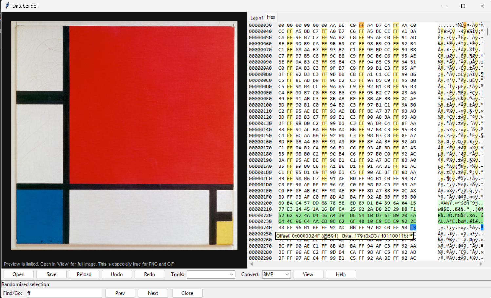

<h1>Databender:</h1>  

<h2>Overview:</h2>
Databender is my dissertation project for my university course, in the department of informatics. Edit image files at byte level, apply automated glitch tools, preview results in real time. 
<h3>Features:</h3>

- Hex editor and Latin-1 editor (fully synchronized)
- automated databending tools
- Real-time image preview (Pillow) & external viewer
- Undo/Redo with visual edit highlights
- Search by hex offset, decimal offset, or byte pattern
- Supports 8 image formats: JPEG, PNG, BMP, GIF, TIFF, WEBP, PPM, TGA

<h2>Libraries needed: </h2>

- Pillow	≥ 9.0.0 
- pyperclip	≥ 1.8.0
- blinker	≥ 1.6.0	
- tkinter

pip install pillow pyperclip blinker
